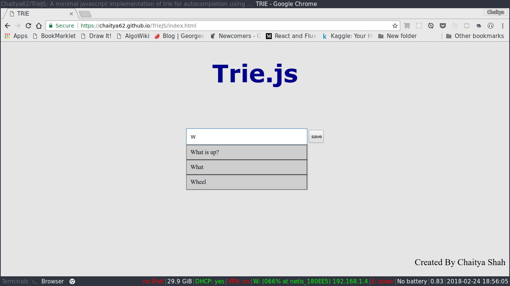

# TrieJS
A minimal javascript implementation of trie for autocompletion using a dictionary of words

Live [demo](https://chaitya62.github.io/TrieJS/index.html)

# Author
[Chaitya Shah](https://chaitya62.github.io/)

# License:

[MIT](./LICENSE) 

